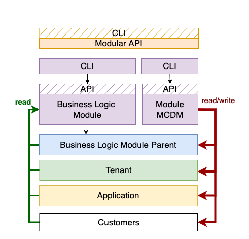

# Modular Service

#### This component is a part of [Open Cloud Management Platform (OCMP)](https://git.epam.com/epmc-eoos/open-cloud-management-platform-docs/-/blob/main/01_ocmp_service_architecture.pdf)

## Modular Service overview

Modular Service - (repo/modular-service) a serverless module that extends
Modular SDK to provide API to manage Modular entities: full read/write access.
Modular Service Admin CLI - (repo/modular-service-admin-cli) is a CLI client
for the Modular Service API. For details, please navigate
to [Modular Service Admin CLI README](modular-service-admin-cli/README.md)

### Notice

All the technical details described below are actual for the particular
version, or a range of versions of the software.

## Modular Service diagram


### Actual for versions: 2.0.0

## Operating modes:

Maestro Common Domain Model module ensures that any other module within the
ecosystem can be operated in two modes:

### With Maestro:

Maestro is a solution that enables effective self-service cloud infrastructure
orchestration,
costs management, monitoring, automation, as well as covers tasks for security,
compliance and risk management in Cloud.
Maestro is the first software service which implemented Modular entities.
More at [Maestro product page](https://www.maestrocontrol.cloud).

  
Acts as a part of Admin CLI, handles core Maestro Entities.
Maestro has write and read permissions on Maestro core entities, while the
Business Logic Module can mostly only read them.

### Without Maestro:

The Modular Service replaces Maestro in terms of core entities management in
case
the Modular-based service (Business Logic Module) is installed without Maestro
in a bundle



It handles the management of Maestro core entities, required for the
Business Logic Module's proper functioning. In this case, Modular Service
Module has both
read and write permissions on Maestro core entities.

## Modular Service

### Lambdas description

### Lambda `modular-api-handler`

This lambda is designed as a handler for all API resources:

* `/signup POST` - Creates new modular user;
* `/signin POST` - Authenticates user in modular service;
* `/policy CRUD` - Manage Policy entity;
* `/role CRUD` - Manage Role entity;
* `/customers CRUD` - Manage Maestro Customer entity;
* `/applications CRUD` - Manage Maestro Application entity;
* `/parents CRUD` - Manage Maestro Parent entity;
* `/tenants CRUD` - Manage Maestro Tenant entity;
* `/regions/ CRUD` - Manage Maestro Region entity;
* `/tenants/regions CRUD` - Manage tenant regions;

Refer
to [Modular Service Admin CLI's README](modular-service-admin-cli/README.md)
for more details. It provides a separate
command for each of the available endpoints.

## Deploy from scratch:

The Modular Service is a serverless module prepared to be deployed
by [Syndicate](https://github.com/epam/aws-syndicate)

1. Configure syndicate configuration files:

- 1.1 syndicate.yml

```yaml
account_id: account_id
aws_access_key_id: deployment_access_key
aws_secret_access_key: deployment_secret_key
deploy_target_bucket: name of the artifacts bucket name.
project_path: /path/to/modular-service/modular-service
region: deployment_region
resources_prefix: prefix (mdlr-)
resources_suffix: suffix (-eoos)
build_projects_mapping:
  python:
    - src/
```

- 1.2 syndicate_aliases.yml

```yaml
account_id: 323549576358
region: eu-west-1
cognito_user_pool_name: congito user pool name
lambdas_alias_name: lambdas_alias (stage)
log_level: DEBUG
```

2. Export env variable `SDCT_CONF` which value is a path to folder
   where `syndicate_aliases.yml` and `syndicate.yml` are located.
3. Execute `syndicate create_deploy_target_bucket` to create s3 bucket for
   bundles.
4. Execute `syndicate build` to assemble to project artifacts.
5. Execute `syndicate deploy` to deploy the resources to an AWS account.

### Environment / system admin user configuration

1. Execute environment configuration script:
   ```bash
   python3 scripts/configure_environment.py  
   --access_key $AWS_ACCESS_KEY \  
   --secret_key $AWS_SECRET_ACCESS_KEY \  
   --session_token $AWS_SESSION_TOKEN \  
   --region $AWS_REGION \  
   --cognito_user_pool_name modular
   ```
2. Save returned admin username and password

### Admin cli configuration

1. Install admin cli:
   `python3 -m pip install $PATH_TO/modular-service/modular-service-admin-cli`
2. Configure modularadmin cli:
   `modularadmin configure --api_link https://$API_ID.execute-api.{REGION}.amazonaws.com/{STAGE}`
3. Login using admin user credentials
   `modularadmin login --username $USERNAME --password $PASSWORD`